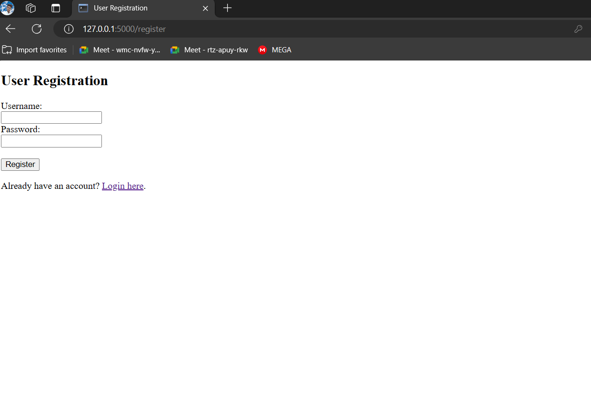
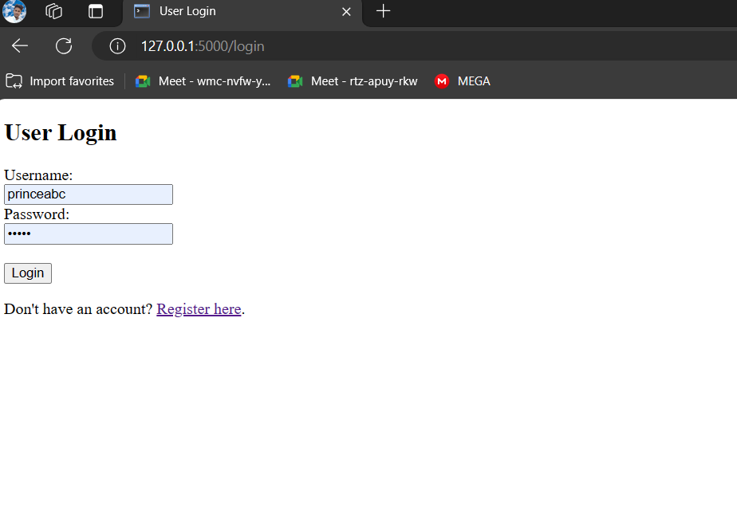
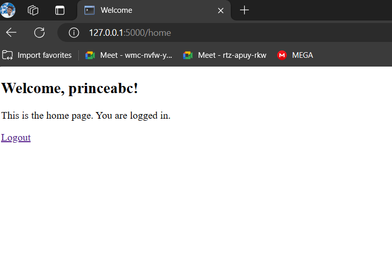
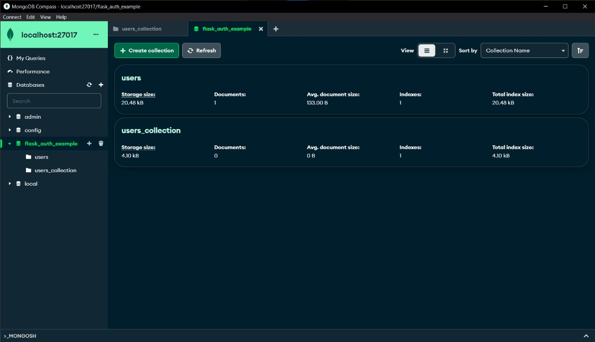
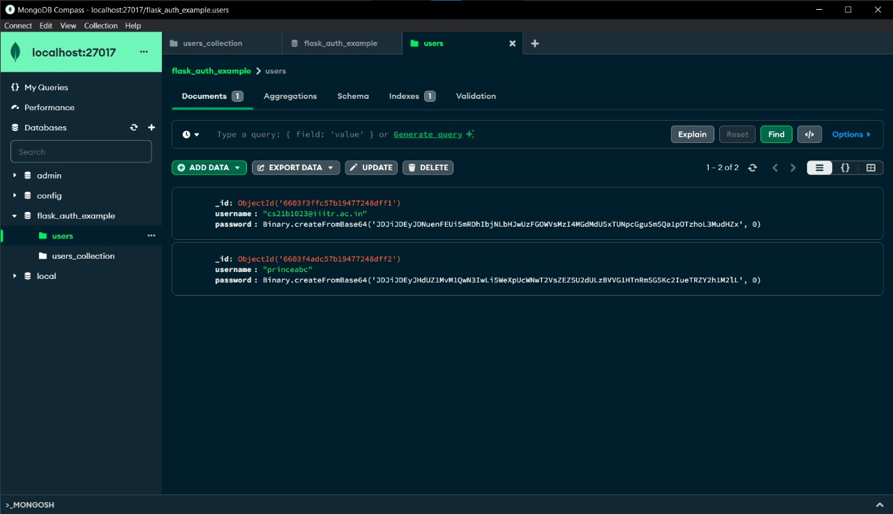

# Flask_auth_system_Mongodb


## Installation

Create a virtual environment for local set-up :
```bash
python -m venv ./venv
venv/Scripts/activate
```
```bash
pip install flask
pip install bcrypt
pip install pymongo
```
## Run 

```bash
python app.py
```
# My Project








## License

[MIT](https://choosealicense.com/licenses/mit/)
